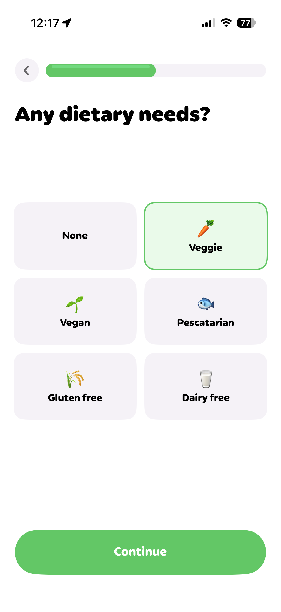
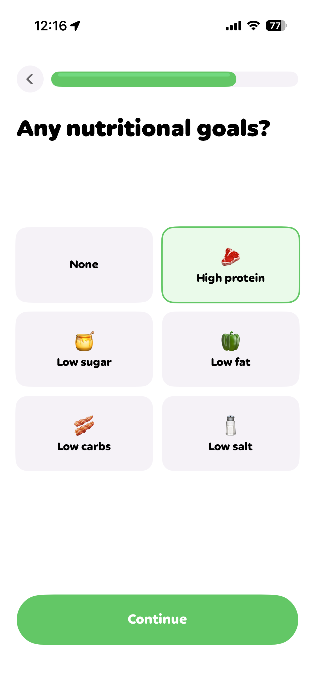
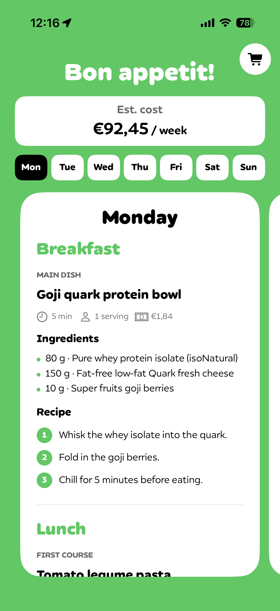

# MealPrep

MealPrep è un’app iOS che genera un piano alimentare settimanale in base al budget e alle preferenze dell’utente.

<table>
  <tr>
    <td></td>
    <td></td>
    <td></td>
    <td></td>
  </tr>
  <tr>
    <center><td>Selezione budget</td></center>
    <center><td>Selezione dieta</td></center>
    <center><td>Selezione obiettivi</td></center>
    <center><td>Piano alimentare generato</td></center>
  </tr>
</table>

[Demo video](https://drive.google.com/file/d/1_Z4yu51ticTJv1rzbJuSd90ryMP6mc1a/view?usp=sharing)


## Funzionalità

- Selezione del budget settimanale.
- Scelta delle esigenze alimentari e degli obiettivi nutrizionali.
- Generazione tramite OpenAI di un piano variato su sette giorni.
- Ricette con ingredienti, tempi, porzioni, costo e passaggi di preparazione.
- Lista della spesa organizzata per categoria e con stato degli acquisti.
- Calcolo locale di confezioni, prezzi dei piatti e costo totale.
- Validazione locale del budget e retry automatici in caso di risultati non validi.

## Come funziona la generazione

Il catalogo dei prodotti si trova in `MealPrep/Resources/product_catalog_en.json`. Tutti i prodotti compatibili con le preferenze vengono inviati al modello in un formato JSON compatto.

OpenAI decide la composizione del piano, le ricette e le quantità. L’app ricostruisce e verifica localmente:

- nomi, marche e categorie dei prodotti;
- numero di confezioni necessarie;
- lista della spesa;
- costo dei singoli piatti;
- costo settimanale complessivo;
- rispetto del budget impostato.

## Configurazione

1. Apri `MealPrep.xcodeproj` con Xcode.
2. Vai su **Product > Scheme > Edit Scheme**.
3. In **Run > Arguments > Environment Variables**, aggiungi:

   ```text
   OPENAI_API_KEY=la_tua_chiave
   ```

4. Avvia l’app 

## Tecnologie utilizzate

- Swift 5
- SwiftUI
- OpenAI Responses API con Structured Outputs
